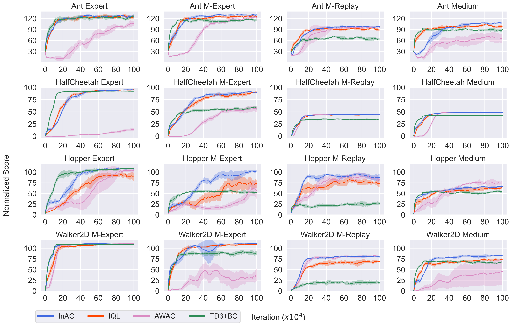

This is a code release for our paper 'The In-Sample Softmax for Offline Reinforcement Learning' (https://openreview.net/pdf?id=u-RuvyDYqCM).

# Running the code:

```
python run_ac_offline.py --seed 0 --env_name Ant --dataset expert --discrete_control 0 --state_dim 111 --action_dim 8 --tau 0.01 --learning_rate 0.0003 --hidden_units 256 --batch_size 256 --timeout 1000 --max_steps 1000000 --log_interval 10000

python run_ac_offline.py --seed 0 --env_name Ant --dataset medexp --discrete_control 0 --state_dim 111 --action_dim 8 --tau 0.01 --learning_rate 0.0003 --hidden_units 256 --batch_size 256 --timeout 1000 --max_steps 1000000 --log_interval 10000

python run_ac_offline.py --seed 0 --env_name Ant --dataset medium --discrete_control 0 --state_dim 111 --action_dim 8 --tau 0.5 --learning_rate 0.0003 --hidden_units 256 --batch_size 256 --timeout 1000 --max_steps 1000000 --log_interval 10000

python run_ac_offline.py --seed 0 --env_name Ant --dataset medrep --discrete_control 0 --state_dim 111 --action_dim 8 --tau 0.5 --learning_rate 0.0003 --hidden_units 256 --batch_size 256 --timeout 1000 --max_steps 1000000 --log_interval 10000

python run_ac_offline.py --seed 0 --env_name HalfCheetah --dataset expert --discrete_control 0 --state_dim 17 --action_dim 6 --tau 0.01 --learning_rate 0.0003 --hidden_units 256 --batch_size 256 --timeout 1000 --max_steps 1000000 --log_interval 10000

python run_ac_offline.py --seed 0 --env_name HalfCheetah --dataset medexp --discrete_control 0 --state_dim 17 --action_dim 6 --tau 0.1 --learning_rate 0.0003 --hidden_units 256 --batch_size 256 --timeout 1000 --max_steps 1000000 --log_interval 10000

python run_ac_offline.py --seed 0 --env_name HalfCheetah --dataset medium --discrete_control 0 --state_dim 17 --action_dim 6 --tau 0.33 --learning_rate 0.0003 --hidden_units 256 --batch_size 256 --timeout 1000 --max_steps 1000000 --log_interval 10000

python run_ac_offline.py --seed 0 --env_name HalfCheetah --dataset medrep --discrete_control 0 --state_dim 17 --action_dim 6 --tau 0.5 --learning_rate 0.0003 --hidden_units 256 --batch_size 256 --timeout 1000 --max_steps 1000000 --log_interval 10000

python run_ac_offline.py --seed 0 --env_name Hopper --dataset expert --discrete_control 0 --state_dim 11 --action_dim 3 --tau 0.01 --learning_rate 0.0003 --hidden_units 256 --batch_size 256 --timeout 1000 --max_steps 1000000 --log_interval 10000

python run_ac_offline.py --seed 0 --env_name Hopper --dataset medexp --discrete_control 0 --state_dim 11 --action_dim 3 --tau 0.01 --learning_rate 0.0003 --hidden_units 256 --batch_size 256 --timeout 1000 --max_steps 1000000 --log_interval 10000

python run_ac_offline.py --seed 0 --env_name Hopper --dataset medium --discrete_control 0 --state_dim 11 --action_dim 3 --tau 0.1 --learning_rate 0.0003 --hidden_units 256 --batch_size 256 --timeout 1000 --max_steps 1000000 --log_interval 10000

python run_ac_offline.py --seed 0 --env_name Hopper --dataset medrep --discrete_control 0 --state_dim 11 --action_dim 3 --tau 0.5 --learning_rate 0.0003 --hidden_units 256 --batch_size 256 --timeout 1000 --max_steps 1000000 --log_interval 10000

python run_ac_offline.py --seed 0 --env_name Walker2d --dataset expert --discrete_control 0 --state_dim 17 --action_dim 6 --tau 0.01 --learning_rate 0.0003 --hidden_units 256 --batch_size 256 --timeout 1000 --max_steps 1000000 --log_interval 10000

python run_ac_offline.py --seed 0 --env_name Walker2d --dataset medexp --discrete_control 0 --state_dim 17 --action_dim 6 --tau 0.1 --learning_rate 0.0003 --hidden_units 256 --batch_size 256 --timeout 1000 --max_steps 1000000 --log_interval 10000

python run_ac_offline.py --seed 0 --env_name Walker2d --dataset medium --discrete_control 0 --state_dim 17 --action_dim 6 --tau 0.33 --learning_rate 0.0003 --hidden_units 256 --batch_size 256 --timeout 1000 --max_steps 1000000 --log_interval 10000

python run_ac_offline.py --seed 0 --env_name Walker2d --dataset medrep --discrete_control 0 --state_dim 17 --action_dim 6 --tau 0.5 --learning_rate 0.0003 --hidden_units 256 --batch_size 256 --timeout 1000 --max_steps 1000000 --log_interval 10000
```

**Update:**

We fixed the policy network for continuous control (Thanks for @typoverflow!). We rerun the affected baselines with 5 runs.  The hyperparameters have been updated above, and the results are reported below.
The fix **did not** change the **overall performance** and the **conclusions** reported in the paper. 



# D4RL installation
If you are using *Ubuntu* and have not got *d4rl* installed yet, this section may help

1. Download mujoco

	I am using mujoco210. It can be downloaded from https://github.com/deepmind/mujoco/releases/download/2.1.0/mujoco210-linux-x86_64.tar.gz
   ```
   mkdir .mujoco
   mv mujoco210-linux-x86_64.tar.gz .mujoco
   cd .mujoco
   tar -xvzf mujoco210-linux-x86_64.tar.gz
   ```

    Then, add mujoco path:

	Open .bashrc file and add the following line:
	```
    export LD_LIBRARY_PATH=$LD_LIBRARY_PATH:<Your_path>/.mujoco/mujoco210/bin
    ```

	Save the change and run the following command:
	```
    source .bashrc
    ```
	
2. Install other packages and D4RL
    ```
    pip install mujoco_py
    pip install dm_control==1.0.7
    pip install git+https://github.com/Farama-Foundation/d4rl@master#egg=d4rl
    ```
	
3. Test the installation in python
    ```
       import gym
       import d4rl
       env = gym.make('maze2d-umaze-v1')
       env.get_dataset()	   
   ```
